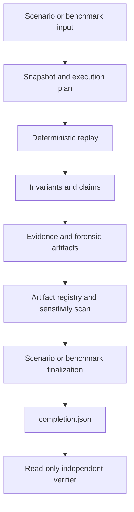

# PRF / Sew technical review guide

## Scope

This packet presents the canonical Protocol Robustness Framework (PRF) execution
path using the Sew protocol model. It is a research and assurance framework,
not a production security certification or deployed-contract audit.

Start with the built Sew distribution:

```bash
java -jar prf-runner-sew-0.1.0-uber.jar help
```

Before inspecting examples, verify the packet from its own root:

```bash
bin/verify-review-packet.sh .
```

This verifies the distributed JAR, selected inputs, review documents, packet
manifest, and every generated evidence bundle using only the packet contents.

The supported review commands are:

```text
run-scenario <scenario> --run-root <fresh-root>
verify-scenario --run-root <completed-root>
run-benchmark <benchmark-id> --run-root <fresh-root>
verify-benchmark --run-root <completed-root>
```

## Architecture and evidence path



For a scenario bundle the evidence chain is:

```text
input snapshot
→ persisted event evidence
→ per-scenario chain finalization
→ run-level reconciliation/finalization
→ artifact registry and validation
→ completion.json
→ verify-scenario
```

For a benchmark bundle the assurance chain is:

```text
input snapshots and execution plan
→ child execution summaries and invariant results
→ conservation projection and benchmark conclusion
→ benchmark assurance
→ registry and validation
→ finalization / final_ref
→ completion.json
→ verify-benchmark
```

## Review corpus

| Input | Review purpose |
|---|---|
| `S-DR-001-basic-release-ruling.edn` | Straightforward successful lifecycle. |
| `S-DR-084-evidence-after-settlement-rejected.edn` | Expected rejected interaction with retained forensic diagnostics. |
| `Y06_multi-party-pro-rata-shortfall.edn` | Atomic shared-pool constrained allocation with deterministic pro-rata handling. |
| `DR-N-002-reversal-slash-appeal-rejected.edn` | Appeal/slashing adversarial path. |
| `sew/sew-force-authorisation-custody-v1` | Multi-execution benchmark with conservation and assurance finalization. |

The packet generator executes and verifies the rejected-interaction scenario,
the pro-rata scenario, the completed semantic-failure scenario, and the
benchmark as evidence examples. `DR-N-002` intentionally concludes `fail`; its
successful verification demonstrates that lifecycle completion and semantic
outcome are distinct. Its reviewer-facing diagnostic diagram is available at
`diagnostics/scenario-semantic-failure/diagnostic.md` (with Mermaid source in
`diagnostic.mmd`); it is derived and non-authoritative. The other selected
definitions are included for focused
manual review; run them into fresh roots before treating them as release
examples.

### Pro-rata allocation evidence

`Y06_multi-party-pro-rata-shortfall.edn` is a single atomic withdrawal over one
shared USDC liquidity pool. Its canonical allocation record is:

```text
scenarios/<scenario-id>/summaries/partial-fill-decisions.json
```

This CORE-inventoried `partial-fill-decisions.v1` projection is derived from the
content-addressed replay decision. It identifies the shared pool, participants,
available liquidity, requested/filled/deferred totals, explicit `pro-rata` and
rounding policy, canonical owner-ID ordering/tie-break policy, per-participant
rows, and conservation/residual checks. For the review scenario it records 3,000
requested, 1,800 shared liquidity, 1,800 filled, and 1,200 deferred: Alice
receives 600/1,000 and Bob 1,200/2,000. The tied-remainder rule for shared
withdrawals is explicit: canonical owner-ID ascending order.

The packet also includes two files under `inputs/test-vectors/pro-rata/`. They
are deterministic **calculator reference vectors** for insufficient liquidity
and rounding dust. They independently exercise the pro-rata calculator; they
are not asserted to be replay witnesses for Y06 and must not be substituted for
the scenario allocation artifact. Sew slashing has separate projection,
claim-evaluation, and allocation-result evidence; these packet examples do not
claim that Y06 is evidence for slashing allocation.

## Inspecting a completed bundle

1. In a generated packet, begin with `REVIEW_PACKET_MANIFEST.json` for the
   selected inputs, JAR hash, evidence roots, and verifier commands.
2. Read `completion.json` for lifecycle status and terminal commitments.
3. Read `manifest/run.json`, `manifest/summary.json`, and
   `manifest/diagnostic-summary.json` for concise execution context.
4. Use `manifest/artifacts.json` as the only authoritative file inventory.
5. Follow root-relative references into scenario summaries and forensic evidence.
6. For the semantic-failure example, read
   `diagnostics/scenario-semantic-failure/diagnostic.md` after verifying the
   authoritative bundle. It is a concise derived timeline, not evidence.
7. Run the matching verifier. A verifier is read-only and fails closed on missing,
   malformed, tampered, or unreconciled required material.

`completion.json` means the evidence lifecycle completed. It does **not** mean
a scenario or benchmark semantically passed. Scenario and benchmark outcomes
remain separate from lifecycle completion.

`verify-scenario` verifies content integrity, declared evidence reconciliation,
and terminal finalization. It is intentionally distinct from optional
forensic-grade claims such as a signed cursor: an unsigned bundle can verify
successfully while a signature-dependent forensic claim reports `fail`. That
reports the absent trust mechanism; it does not invalidate the content-addressed
bundle or assert operator identity.

## Limits and maturity

PRF currently provides structured, content-addressed evidence, deterministic
model replay, artifact inventory, sensitivity scanning, and independent
verification for its canonical scenario and benchmark commands.

It does not claim that:

- a Solidity implementation is automatically converted into a complete model;
- unsigned evidence proves operator identity, signer authority, or runtime
  isolation;
- a bounded scenario or benchmark establishes protocol-wide security;
- external benchmark packs are currently supported; filesystem manifests remain
  intentionally quarantined until their full dependency closure is snapshotted;
- standalone forensic-run isolation is complete.

Legacy/internal execution paths remain in the repository for compatibility and
research, but are not part of this review surface.
