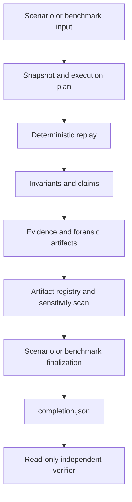

# PRF / Sew technical review guide

## Scope

This packet presents the canonical Protocol Robustness Framework (PRF) execution
path using the Sew protocol model. It is a research and assurance framework,
not a production security certification or deployed-contract audit.

Start with the built Sew distribution:

```bash
java -jar prf-runner-sew-0.1.0-uber.jar help
```

Before inspecting examples, verify the packet from its own root:

```bash
bin/verify-review-packet.sh .
```

This verifies the distributed JAR, selected inputs, review documents, packet
manifest, and every generated evidence bundle using only the packet contents.

The supported review commands are:

```text
run-scenario <scenario> --run-root <fresh-root>
verify-scenario --run-root <completed-root>
run-benchmark <benchmark-id> --run-root <fresh-root>
verify-benchmark --run-root <completed-root>
```

## Ownership boundary

This packet evaluates **one protocol implementation** (Sew) against **PRF-core
concepts**. The canonical benchmark definition, claims, concept vocabulary, and
assurance validators live in PRF core. Sew supplies the scenario suite and
protocol adapter that exercise those concepts.

The generated benchmark output records this split:

| Field | Source | Value in this packet |
|---|---|---|
| `benchmark_owner` | `benchmark/summary.json` | `prf-core` |
| `suite_provider` | `benchmark/summary.json` | `protocol/sew` |
| `:benchmark/id` | benchmark definition | `:benchmark/force-authorisation-custody-v1` |
| `:benchmark/suite-provider` | benchmark definition | `{:provider/id :protocol/sew :suite/id :suite/sew-force-authorisation-custody-v1}` |

## Architecture and evidence path



For a scenario bundle the evidence chain is:

```text
input snapshot
→ persisted event evidence
→ per-scenario chain finalization
→ run-level reconciliation/finalization
→ artifact registry and validation
→ completion.json
→ verify-scenario
```

For a benchmark bundle the assurance chain is:

```text
input snapshots and execution plan
→ child execution summaries and invariant results
→ conservation projection and benchmark conclusion
→ benchmark assurance
→ registry and validation
→ finalization / final_ref
→ completion.json
→ verify-benchmark
```

## Review corpus

| Input | Review purpose |
|---|---|
| `S-DR-001-basic-release-ruling.edn` | Straightforward successful lifecycle. |
| `S-DR-084-evidence-after-settlement-rejected.edn` | Safe control: late evidence after settlement is rejected and the finalized workflow remains unchanged. |
| `S-NC-001-freeze-active-dispute-negative-control.edn` | Intentional semantic-failure control: a successful slash transition leaves a frozen resolver assigned to an active dispute, violating a protocol invariant. |
| `Y06_multi-party-pro-rata-shortfall.edn` | Atomic shared-pool constrained allocation with deterministic pro-rata handling. |
| `DR-N-002-reversal-slash-appeal-rejected.edn` | Appeal/slashing adversarial path for focused manual review. |
| `force-authorisation-custody-v1` | Multi-execution benchmark with conservation and assurance finalization. |

### Force-authorisation custody benchmark scope

`force-authorisation-custody-v1` is a **PRF-core benchmark** evaluated using the
**Sew protocol implementation**. The benchmark definition, 5 generic
force-authorisation claims (`:force-authorisation/scope-enforced`,
`:force-authorisation/single-use`, `:force-authorisation/expiry-enforced`,
`:force-authorisation/evidence-linkage`, `:force-authorisation/custody-isolation`),
and concept vocabulary (`data/concepts/security/force_authorisation.edn`) are
owned by PRF core. Sew supplies the scenario suite
(`:suite/sew-force-authorisation-custody-v1`) and protocol adapter.

The benchmark resolves its definition and runs two deterministic Sew executions:
a force-authorisation basic path and an expired-authorisation path. Its evidence
evaluates the exercised custody/conservation-oriented invariants and benchmark
assurance, then finalizes and verifies the resulting package.

This split is recorded in the benchmark's `:benchmark/suite-provider` metadata
and exposed in `benchmark/summary.json` as `suite_provider: "protocol/sew"`.

This is trace-bounded benchmark evidence only. It is **not** a general proof of
custody solvency, deployed Solidity verification, signer/operator assurance,
consensus among independent runners, operational Sew pro-rata slashing, or a
pro-rata evidence artifact. The benchmark deliberately does not exercise the
pro-rata allocation, shared-withdrawal propagation, or mechanism-evidence paths.

The packet generator executes and verifies the safe rejected-interaction control,
the pro-rata scenario, `DR-N-002` as the completed semantic-failure control, and
the benchmark as evidence examples. `DR-N-002` reaches an unsuppressed invariant
violation without aborting the outer lifecycle; its successful package
verification demonstrates that lifecycle completion, content integrity, and
runnability are distinct from semantic success. Its reviewer-facing diagnostic
diagram is available at `diagnostics/scenario-semantic-failure/diagnostic.md`
(with Mermaid source in `diagnostic.mmd`); it is derived and non-authoritative.
`S-NC-001` remains included as an explicitly labelled manual negative-control
input; it is not the generated package example in this packet.

For a concise review order, high-value claim categories, value-at-risk framing,
reversal review, and the evidence-chain/package boundary, see
[`SCENARIO_REVIEW_HIGHLIGHTS.md`](SCENARIO_REVIEW_HIGHLIGHTS.md). It is a
non-authoritative reviewer aid and does not replace package verification.

### Pro-rata allocation evidence

`Y06_multi-party-pro-rata-shortfall.edn` is a single atomic withdrawal over one
shared USDC liquidity pool. Its canonical allocation record is:

```text
scenarios/<scenario-id>/summaries/partial-fill-decisions.json
```

This CORE-inventoried partial-fill-decision projection is derived from the
content-addressed replay decision. It identifies the shared pool, participants,
available liquidity, requested/filled/deferred totals, explicit `pro-rata` and
rounding policy, canonical owner-ID ordering/tie-break policy, per-participant
rows, and conservation/residual checks. New canonical shared-withdrawal paths
also bind the propagation to the decision's `pro-rata-mechanism-evidence.v1`
envelope, which contains the complete versioned allocation result and its cap,
quota, remainder, and active-set round witnesses. The envelope is domain-neutral:
shared-withdrawal accounting and deferred-position semantics remain in the domain
propagation/application evidence. It is carried by domain evidence today; it is
not yet a standalone package-registered mechanism DAG node.

For the review scenario the decision records 3,000 requested, 1,800 shared
liquidity, 1,800 filled, and 1,200 deferred: Alice receives 600/1,000 and Bob
1,200/2,000. The tied-remainder rule for shared withdrawals is explicit:
canonical owner-ID ascending order.

The packet also includes two files under `inputs/test-vectors/pro-rata/`. They
are deterministic **calculator reference vectors** for insufficient liquidity
and rounding dust. They independently exercise the pro-rata calculator; they
are not asserted to be replay witnesses for Y06 and must not be substituted for
the scenario allocation artifact. Sew slashing has separate projection,
claim-evaluation, and allocation-result evidence. Its production pro-rata adapter
retains a hash-bound reference to the complete generic mechanism envelope while
preserving historical liable-party presentation order. Legacy Sew projection
claims remain projection-scoped; they do not assert cap, quota, remainder, or
redistribution-round witness claims. These packet examples do not claim that Y06
is evidence for slashing allocation.

The mechanism envelope carries a `:mechanism/validation-results` field recording
only local structural validation summaries — hash validity, cap compliance,
quota bounds, round-trace coherence, and canonical remainder assignment. These
are integrity checks against the allocation result itself, not claim-engine
evaluations. Claim-engine evidence remains a separate integration concern and
is not included in this envelope. See
[`PRO_RATA_ALLOCATION_BINDING_V2.md`](../architecture/PRO_RATA_ALLOCATION_BINDING_V2.md)
for the exact authority chain, v1/v2 compatibility boundary, and explicit
deferrals.

## Inspecting a completed bundle

1. In a generated packet, begin with `REVIEW_PACKET_MANIFEST.json` for the
   selected inputs, JAR hash, evidence roots, and verifier commands.
2. Read `completion.json` for lifecycle status and terminal commitments.
3. Read `manifest/run.json`, `manifest/summary.json`, and
   `manifest/diagnostic-summary.json` for concise execution context. Use
   `SCENARIO_REVIEW_HIGHLIGHTS.md` to prioritize claim, custody, finality, and
   value-at-risk review without treating its derived summaries as authoritative.
4. Use `manifest/artifacts.json` as the only authoritative file inventory.
5. Follow root-relative references into scenario summaries and forensic evidence.
6. For the semantic-failure example, read
   `diagnostics/scenario-semantic-failure/diagnostic.md` after verifying the
   authoritative bundle. It is a concise derived timeline, not evidence.
7. Run the matching read-only verifier (`verify-scenario` or
   `verify-benchmark`). It revalidates the completed bundle's committed
   inventory, finalization, and terminal package bindings. A verifier success
   establishes structural/content integrity for the documented profile; it does
   not turn a semantic failure into a semantic pass or provide signer identity.

`completion.json` means the evidence lifecycle completed. It does **not** mean
a scenario or benchmark semantically passed. Scenario and benchmark outcomes
remain separate from lifecycle completion.

The completion-first package-assurance API verifies content integrity, declared
evidence reconciliation, and terminal finalization for the supported
single-scenario profile. It is intentionally distinct from optional
forensic-grade claims such as a signed cursor: an unsigned package can be
integrity-valid and runnable while release eligibility reports `false` because
signer/operator assurance is absent. That reports the absent trust mechanism; it
does not invalidate the content-addressed package or assert operator identity.

## Cross-repository trace equivalence (Clojure simulation → Solidity)

PRF implements Clojure-to-Solidity trace equivalence through a cross-repository
workflow. Selected CDRS v0.2 traces generated by the Clojure simulation are
replayed by Foundry against the live Solidity contracts, with per-step
comparison of a six-field EVM projection.

The equivalence suite is defined in `etc/trace-solidity-manifest.edn`, which
cryptographically binds each Clojure-generated source trace to its Forge fixture
via SHA-256. The manifest, sync, and verify commands are in:

- **Manifest**: `etc/trace-solidity-manifest.edn`
- **Sync**: `scripts/trace-solidity-sync.py` (`bb trace:solidity:sync`)
- **Verify**: `scripts/trace-solidity-verify` (`bb trace:solidity:verify`)

### Reproducible review procedure

```bash
# Step 1 — On the Clojure simulation checkout:
#   Export or regenerate the selected traces into sew-protocol
bb trace:solidity:sync --sew-repo ../sew-protocol

# Step 2 — Verify the exported fixtures are cryptographically bound
bb trace:solidity:verify --sew-repo ../sew-protocol
# This must report "All checks passed." before proceeding.

# Step 3 — On the sew-protocol Solidity checkout:
cd ../sew-protocol

# Step 3a — Run the full trace equivalence suite
forge test --match-contract TraceEquivalenceTest -vvv

# Step 3b — Run negative tests (semantic mismatch detection)
forge test --match-contract TraceEquivalenceTest --match-test test_negative -vvv
```

### What this procedure establishes

1. **Clojure generated the trace** — `trace:export` produces the CDRS v0.2
   fixture from the canonical scenario input.
2. **The exported trace is byte-for-byte equivalent** to the Forge fixture —
   `trace:solidity:verify` asserts SHA-256 match between source and destination.
3. **Forge replayed that fixture** — `TraceEquivalenceTest` replays every step
   against live EscrowVault contracts.
4. **Each applicable step matched the six-field projection** — escrow state,
   amount after fee, total held, total fees, pending settlement existence,
   dispute level (see `TraceEquivalence.t.sol` lines 33-40).
5. **Semantic post-assertions passed** — resolution outcome, escalation level,
   participation roles, timing booleans.
6. **Negative tests demonstrably fail** — assertions N01-N07 verify that
   expected semantic violations produce test failures.

### Currently synchronised traces

The manifest (`etc/trace-solidity-manifest.edn`) currently contains 18 traces
spanning four suites:

| Suite | Traces | Coverage |
|-------|--------|----------|
| sew-domain-reference-v1 | 5 | Core protocol conflict scenarios |
| reference-validation-v1 | 8 | Adversarial / CI review paths |
| ef-review-v1 | 5 | EF review scenarios (see review corpus) |

Each trace is assigned a concrete destination path in the Solidity repo
(`test/foundry/traces/v2/`) and verified by `bb trace:solidity:verify`.

## Limits and maturity

PRF currently provides structured, content-addressed evidence, deterministic
model replay, artifact inventory, sensitivity scanning, and independent
verification for its canonical scenario and benchmark commands.

It does not claim that:

- a Solidity implementation is automatically converted into a complete model;
- unsigned evidence proves operator identity, signer authority, or runtime
  isolation;
- a bounded scenario or benchmark establishes protocol-wide security;
- external benchmark packs are currently supported; filesystem manifests remain
  intentionally quarantined until their full dependency closure is snapshotted;
- standalone forensic-run isolation is complete;
- **all** simulation traces are synchronised to the Solidity repo — only the
  manifest-selected subset is cryptographically bound and verified. The
  manifest is the authoritative cross-repository evidence chain.

Legacy/internal execution paths remain in the repository for compatibility and
research, but are not part of this review surface.

## Researcher-led benchmark evidence chain

This packet introduces two new content-addressed evidence chains for
researcher-led benchmark evaluation. Both are optional, independently
recomputable, and bound through the package index.

### Pro-rata evidence chain

```text
allocation request/result
→ allocation evidence profile (pro-rata-allocation-evidence.v1)
→ propagation/application artifacts
→ accounting and state write-back evidence
→ application evidence profile (pro-rata-application-evidence.v1)
→ theorem and conclusion artifacts
→ execution evidence profile (pro-rata-execution-evidence.v1)
→ package index
→ independent verifier
```

**Allocation evidence profile** verifies:
- hash integrity of the allocation result
- capacity bounds (each allocation ≤ effective cap)
- quota compliance (each allocation within [floor, ceil] of adjusted quota)
- conservation (requested = allocated + unmet + residual)
- canonical remainder assignment (for largest-remainder rounding)
- round-trace coherence (redistribution continuity)
- residual validity (unallocated amount matches observed state)

**Application evidence profile** verifies:
- propagation-allocation binding
- apparent application recording
- accounting reconciliation
- authoritative state write-back verification (withdrawn balance matches)
- deferred current-amount continuity
- next-precondition continuity (verified : not-observed : failed)

**Execution evidence profile** verifies:
- allocation and application profile binding
- outcome-manifest binding
- theorem and conclusion hash binding

**Key distinction: apparent application ≠ authoritative write-back.**
A propagation may record an apparent-accounting delta that reconciles with
accounting entries, while the authoritative withdrawn balance in the final
world state does not match. The application profile reports both facts
independently — allowing the reviewer to see exactly where the chain breaks.

**Continuity status vocabulary:**
- `:verified` — the successor state matches the committed next precondition
- `:not-observed` — terminal scenario with no later transition (not a failure)
- `:failed` — the next precondition state does not match

### Force-authorisation evidence chain

```text
policy
→ review round
→ signed researcher decisions (Ed25519)
→ force-authorisation artifact (researcher-force-authorisation.v1)
→ reservation artifact (force-authorisation-reservation.v1)
→ outcome manifest (:execution/force-authorisation section)
→ terminal consumption receipt (force-authorisation-consumption.v1)
→ evidence profile (force-authorised-execution-evidence.v1)
→ package index
→ independent verifier
```

**Force-authorisation artifact** records:
- portable policy reference (by hash, not embedded)
- review-round identity
- signed researcher decisions with Ed25519 signatures
- target commitment (branch descriptor, baseline and proposed content roots)
- approval threshold and decision status
- deterministic single-use consumption key

**Decision statuses:**
- `:approved` — threshold met, no dissent
- `:approved-with-dissent` — threshold met, dissent preserved
- `:declined` — threshold not met

**Reservation artifact** (created before execution):
- authorisation hash, consumption key, execution attempt, command root, plan root

**Terminal consumption receipt** (created after outcome manifest):
- reservation hash, authorisation hash, consumption key, resulting outcome hash

**Consumption statuses (all terminal — no reuse):**
- `:consumed` — execution completed successfully
- `:failed-after-consumption` — reserved, execution failed; terminal evidence
  required (use `:not-captured` when none was written)
- `:rolled-back-after-consumption` — reserved, consumed, rolled back;
  terminal evidence required

**Evidence profile** independently recomputes every verification boolean
by calling existing validators:
- `validate-authorisation` — structural validity
- `verify-against-policy` — policy rules satisfied
- `verify-against-round` — decision-makers are round members
- `verify-decision-signatures` — all three decisions cryptographically authentic
- `verify-fa-binding` — manifest ↔ auth + reservation cross-references
- `verify-consumption-receipt` — receipt ↔ reservation + outcome consistency

### Execution scope vs authorisation provenance

Two predicates distinguish semantic scope from governance provenance:

```clojure
(exact-execution-scope? a b)
;; true when both manifests have the same content-root, model-root,
;; execution fields, and executed-content-root — regardless of whether
;; force-authorisation was used or who authorised it.

(same-authorisation-provenance? a b)
;; true when both manifests share the same authorisation-hash,
;; reservation-hash, consumption-key, and execution-attempt-id.
;; Returns true when both lack an FA section.
```

This means two researchers who independently authorise the same branch
can produce exact-replication-scope outcomes with different provenance.

### Package-bound verification

When an outcome manifest declares `:execution/force-authorisation`, the
package index must contain the complete dependency chain:

```
policy
review round
force-authorisation artifact
reservation artifact
outcome manifest
terminal consumption receipt
evidence profile
```

`verify-package-completion-force-authorised` resolves each artifact by
committed hash from the package index and verifies the full dependency
closure. Ordinary packages without an FA section are unaffected.

### Demonstrative test cases

**Case 1: Ordinary quota-bounded partial fill**
A standard pro-rata allocation with complete propagation, application,
accounting, and state write-back. All evidence profiles verify cleanly.
No force-authorisation invoked. Exact execution scope = true.
No authorisation provenance (FA section absent).

**Case 2: Authoritative write-back failure despite accounting**
Accounting entries reconcile with apparent application deltas.
Authoritative withdrawn balance does not match. Application profile
reports `:accounting-reconciled? true` but
`:authoritative-state-write-back-verified? false`. The profile remains
structurally valid — it records the specific failure, not a silent pass.

**Case 3: Valid-artifact substitution rejection**
Two independently valid allocation results (A and B). An application
profile bound to allocation A receives allocation B during verification.
Every artifact is individually valid. Cross-artifact verification
rejects the package because the allocation hash does not match.

**Case 4: Independently authorised reproduction**
Two different review rounds, different authorisation artifacts, different
reservation hashes — same executed branch. `exact-execution-scope?`
returns true (same content root, plan, executed content).
`same-authorisation-provenance?` returns false (different hashes).

### What the evidence chain proves

- A pro-rata allocation was calculated under a declared mechanism and
  policy, with a complete and internally consistent allocation witness.
- The committed propagation and application artifacts correspond to that
  exact allocation.
- Accounting deltas and authoritative state changes either reconcile or
  the specific failure point is identified.
- The deferred residual is preserved as the successor current amount.
- Later transitions consume that state when applicable (or the terminal
  status is reported as `:not-observed`).
- Force-authorisation was approved under a referenced policy by an
  authentic threshold of frozen review-round members.
- The resulting authorisation was reserved once, executed against the
  committed branch, and terminally consumed.

### What the evidence chain observes but does not establish

- The authorised branch may have been executed under the committed
  target but the execution evidence is recorded, not independently
  enforced by this layer.
- The consumption event is recorded; durable cross-process single-use
  enforcement requires a reservation backend beyond the in-process atom.
- Apparent application accounting may reconcile while authoritative
  state write-back fails; both facts are reported independently.
- The conclusion claims are bound to the outcome manifest; overreach
  (a conclusion claiming more than the evidence supports) is detected
  only when the conclusion references theorems that were not committed.

### Out of scope for these evidence profiles

- Universal incentive compatibility — operational pro-rata evidence does
  not establish coalition or strategy-proof incentive properties unless a
  separate incentive theorem was produced.
- Distributed double-execution prevention — the in-process atom backend
  is correct for single-JVM testing. Durable cross-process enforcement
  requires a filesystem lock, database transaction, or other distributed
  reservation backend.
- Runner-wide mandatory generation — these profiles are optional for
  ordinary benchmark packages and required only when the outcome
  manifest contains specific evidence declarations.
- Package-level release gating — these verification checks inform but do
  not gate the release pipeline in this packet.
