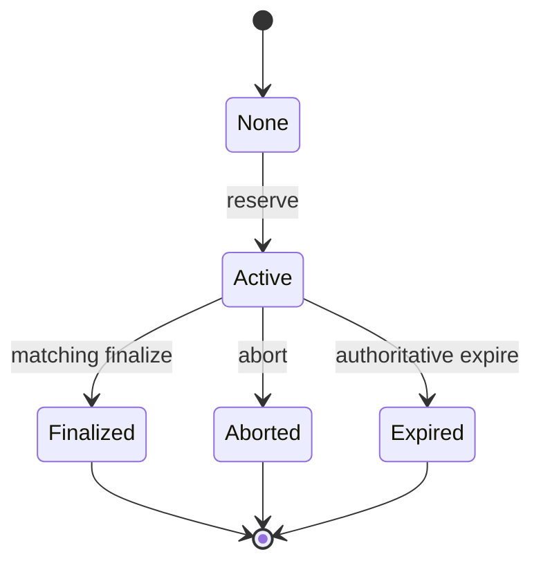
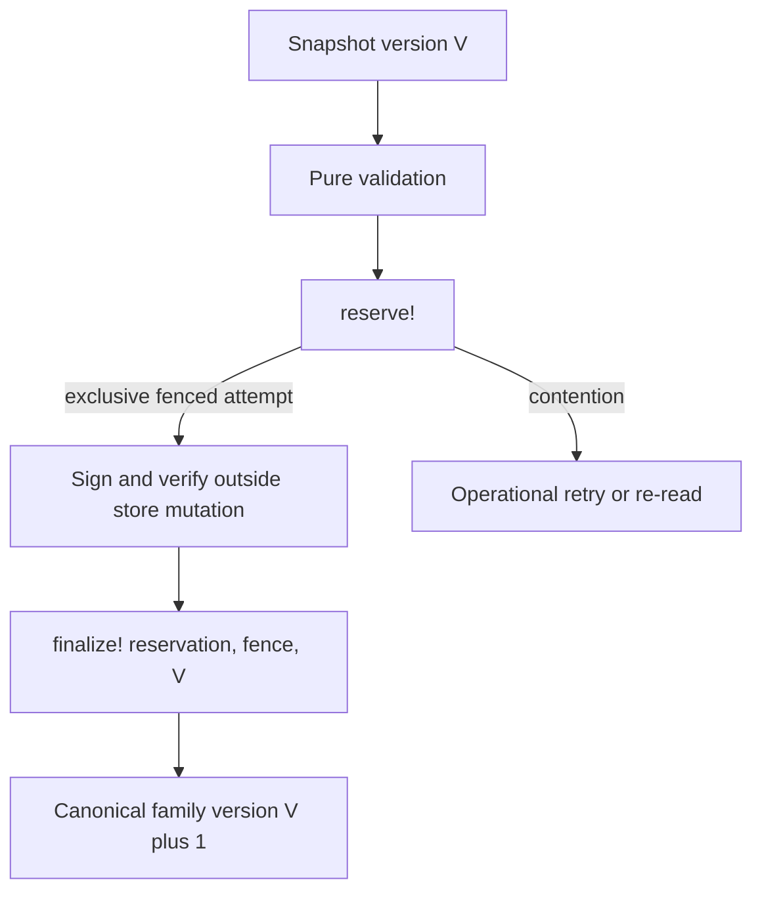

# Resubmission admission concurrency contract

Status: **reference contract implemented in memory; no durable adapter yet.**

This contract governs the path from a validated resubmission candidate to a
canonical family-head transition. It deliberately separates pure parallel work
from the one conditional mutation boundary for a family.

## Concurrency envelope

Every read or mutation carries:

```clojure
{:concurrency/partition-key [:resubmission-family family-id]
 :concurrency/snapshot-root snapshot-root
 :concurrency/expected-state-version state-version
 :concurrency/idempotency-key idempotency-key}
```

A successful reservation also carries `:reservation/id` and an increasing
`:concurrency/fence`. Different partitions may progress independently.
Concurrent readers of one partition may share a snapshot. Concurrent mutations
of one partition may arrive together, but only a conditionally committed
canonical history is authoritative.

## Guarantees

- **C1 Snapshot consistency:** every validation check identifies the same
  snapshot root/version and candidate root.
- **C2 Partition independence:** one family cannot change another family's
  semantic outcome.
- **C3 Serializable mutation:** a family head/version changes only through one
  conditional finalization.
- **C4 Deterministic observation:** check completion order cannot affect roots,
  findings, validation aggregates, or canonical report order. This is not a
  deterministic arbitration rule for distinct conflicting candidates.
- **C5 Retry equivalence:** identical reserve/finalize retries resolve to their
  authoritative prior outcome.
- **C6 Failure isolation:** a stalled family or signer does not block another
  partition.
- **C7 Stale-authority exclusion:** a response from a superseded fence cannot
  become canonical.

## Reservation state



At most one active mutation reservation exists per family. Competing distinct
candidates at the same family version are arbitrated by the successful
linearization of `reserve!`; v1 does not guarantee the same winner under a
different reservation schedule. A contention result is operational, not a
canonical semantic rejection. A reservation is coordination state, not an
admitted receipt. Its fence is monotonic and never
reused during an adapter lifetime. A durable adapter must preserve that
monotonicity across its supported recovery model; arbitrary point-in-time
rollback cannot honestly make that claim without a non-rollbackable epoch or
fence source.

In v1, an expired/aborted reservation closes that idempotency key. Recovery
creates a new logical attempt with a fresh idempotency key, fresh snapshot,
validation, reservation, and fence. The partition-scoped idempotency binding
remains permanent:

```text
(partition-key, idempotency-key) -> candidate-root
```

The same key with another candidate is `:idempotency-conflict`.

## Validation and signing bindings

A `resubmission-validation.v1` aggregate commits its required check set,
validation profile/version, partition, snapshot, candidate, and canonical
ordered check results. The reservation binds:

- candidate root;
- validation root;
- **proposed** ordering root;
- idempotency key;
- expected state version;
- reservation ID and fence.

The proposed ordering is inert until finalization atomically publishes it with
the canonical receipt, family head, and incremented family version. Persisting
a content-addressed blob does not make it canonical.

Signer work runs outside the partition mutation critical section. A signer may
return late, but finalization must reject a non-current fence, non-active
reservation, stale state version, signing-payload mismatch, or any binding
mismatch. A signature alone has no canonical authority.

## v1 linearization



`reserve!` grants only the exclusive fenced right to attempt finalization for
one family version. `finalize!` atomically verifies the active reservation,
current fence, expected version, candidate, validation, proposed ordering, and
signing payload before publishing canonical state. No later stage may select a
new winner.

## Adapter boundary

`resolver-sim.resubmission.admission-store/ResubmissionAdmissionStore` is the
storage interface. `InMemoryAdmissionStore` is a pure-transition reference
adapter with per-family JVM-local CAS. It is not durable and does not claim
restart-safe fences or multi-process linearizability.

`resolver-sim.resubmission.postgres-admission-store/PostgresAdmissionStore`
implements the same transitions using one PostgreSQL row per family, a
serializable transaction, and `SELECT ... FOR UPDATE`. It publishes family
state, version/head, reservation terminal state, and finalization record in one
transaction. It is opt-in and requires explicit `ensure-schema!` migration plus
a deployment recovery model that preserves monotonically increasing fences.

A durable adapter must provide linearizable conditional `reserve!`, `finalize!`,
`abort!`, and `expire!`; persist exact-finalization replay records; and never
let recovery invent canonical outcomes. Recovery may withdraw stale
coordination authority, but may finalize only through normal preconditions and
exact evidence.

## v1 liveness and interruption policy

Callback failures are structurally distinct operational outcomes:
`:signing-failed`, `:signature-invalid`, and `:workflow-failed`. Each aborts
only the exact reservation ID/fence, leaves canonical family version unchanged,
and allows a later retry. Repeated abort is idempotent; an abort under a stale
fence is rejected and cannot disturb newer authority.

For a worker crash after reservation or after signing, v1 uses authoritative
abort/expiry followed by a fresh logical attempt (including a fresh idempotency
key), snapshot, validation, reservation, and fence. An old signature is bound
to its old reservation/fence and cannot authorize the replacement. Recovery
never infers that a signer probably succeeded; it may only withdraw
coordination authority unless it performs the ordinary matching finalization
transition with exact persisted evidence.

After `finalize!` may have reached the authoritative store, a timeout or
transport exception is `:finalization-indeterminate`, not a reason to abort.
The caller resolves reservation/finalization state authoritatively: a matching
finalization returns the committed result; an active matching reservation may
replay the exact finalization request; expired/aborted/stale authority is
non-admission. Exact finalization replay is idempotent.
